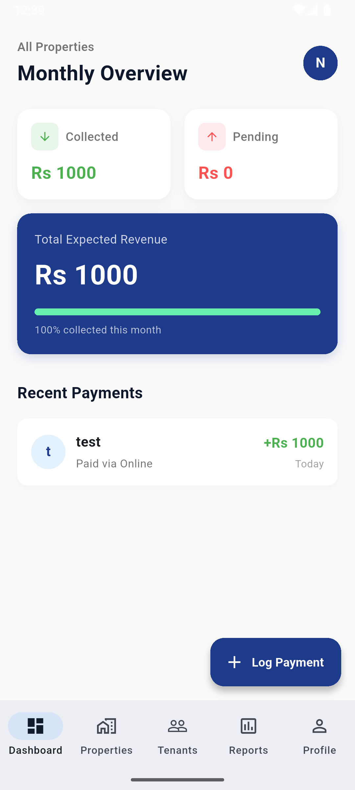
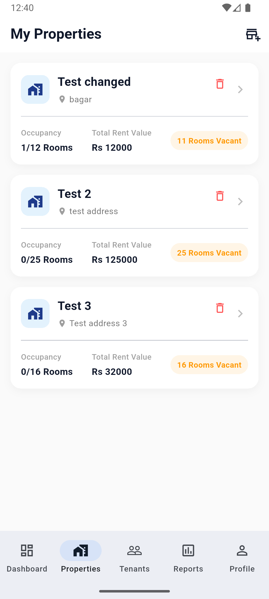
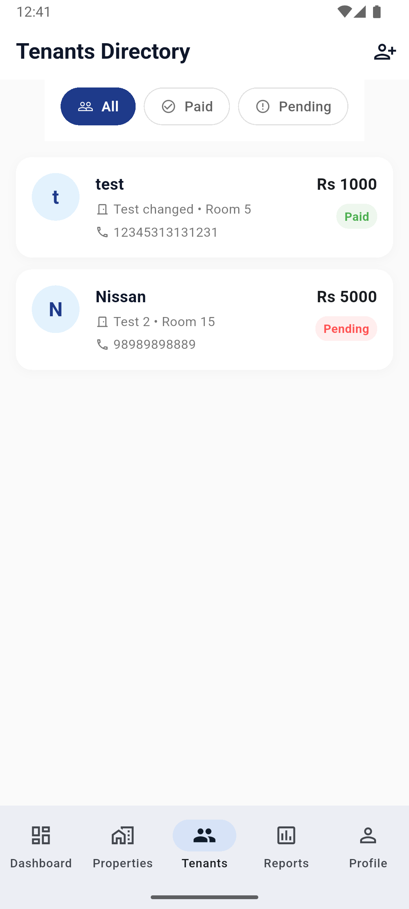
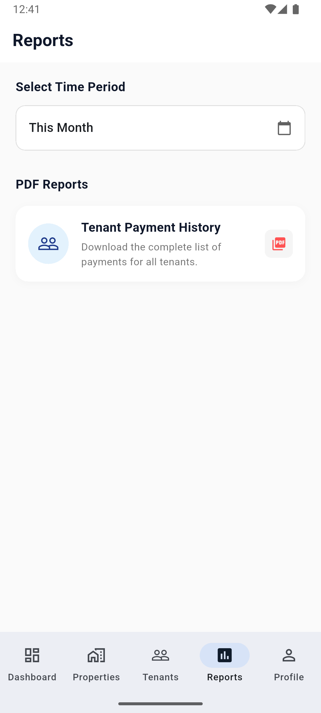
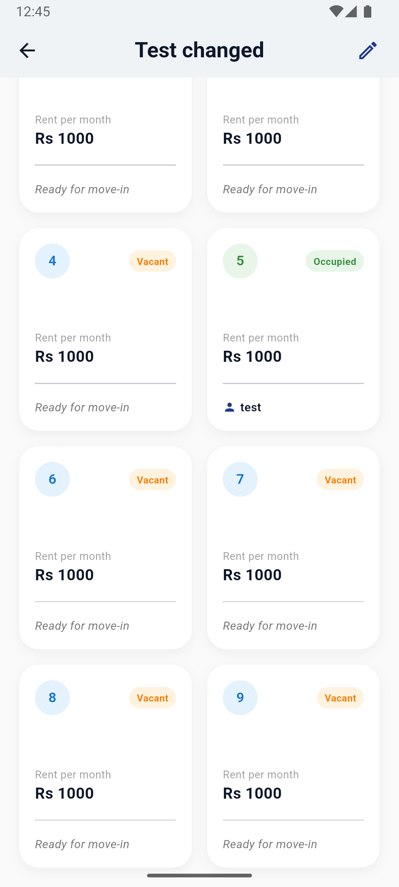
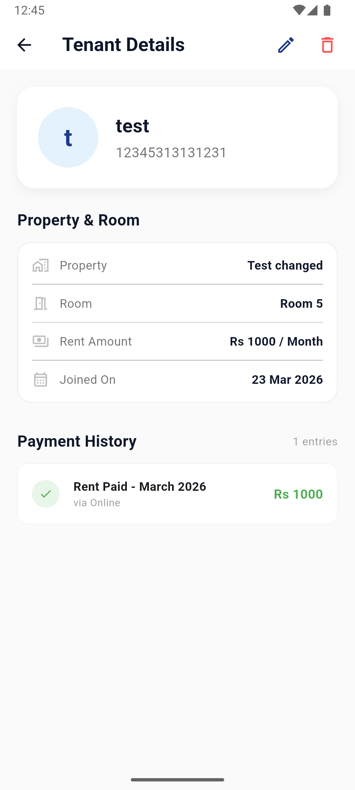
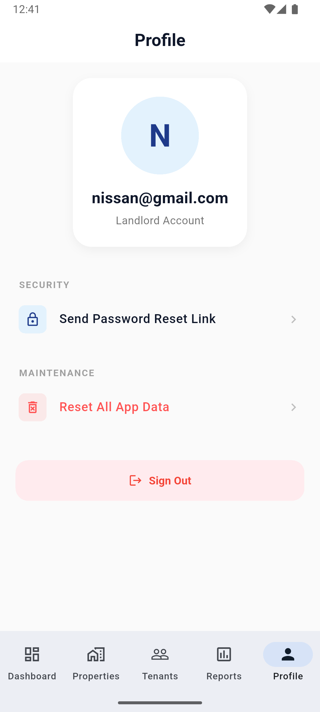
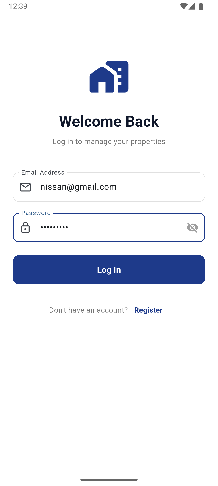
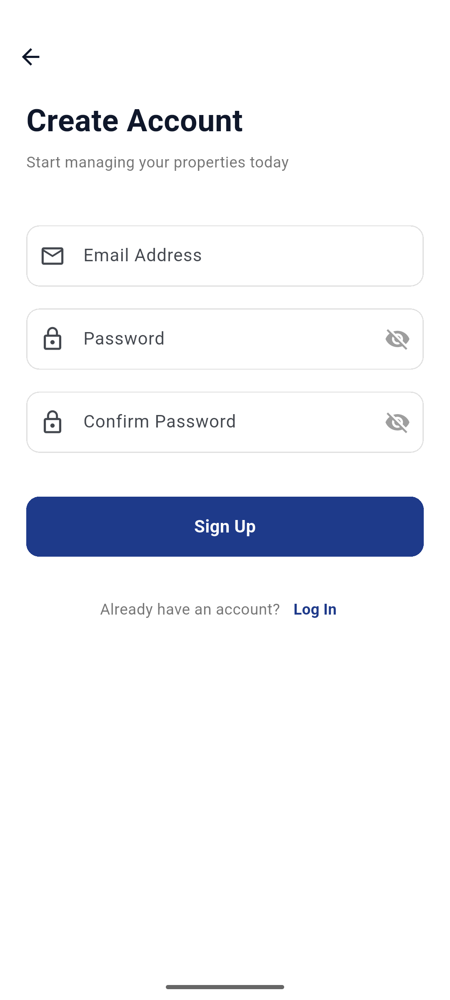

# Rent Flow

Rent Flow is a professional property management application designed for landlords to streamline rental operations. It provides a centralized platform for tracking properties, managing tenants, and logging payments with real-time Firebase synchronization.

## Visual Overview

  <h4>Core Navigation</h4>
  
  
  
  
  
  <h4>Detailed Management</h4>
  
  
  
  <h4>Account & Security</h4>
  
  
  

## Core Features

### Management Dashboard
-   **Collection Tracking**: Monitor monthly rent collection status and pending dues.
-   **Smart Payment Logging**: Automated rent lookup for selected tenants with safeguards against duplicate monthly entries.
-   **Statistical Analysis**: Real-time progress indicators for expected versus actual revenue.
-   **Interactive Navigation**: Quick-access profile and navigation shortcuts.

### Property & Inventory Management
-   **Multi-Property Support**: Manage several buildings and their respective units.
-   **Room Status Tracking**: Real-time vacancy and occupancy monitoring.
-   **Data Integrity Safeguards**: System-level prevention of property deletion while active tenants are present.

### Tenant Operations
-   **Automated Reminders**: One-tap SMS reminder functionality with pre-filled billing details.
-   **Occupancy Syncing**: Automatic room status updates (vacating) upon tenant removal.
-   **Status Categorization**: Distinct flagging of Paid, Pending, and Overdue accounts based on join dates.

### Financial Reporting
-   **PDF Exporting**: Generation of comprehensive payment history reports.
-   **Periodic Filtering**: Support for Monthly, Bi-Annual, and Annual data extraction.
-   **Professional Layout**: Document headers include property and room metadata for record-keeping.

### Account & Security
-   **Firebase Authentication**: Secure login and registration flows.
-   **Security Management**: Email-driven password recovery system.
-   **Administrative Controls**: Database reset capabilities for clearing historical records.

## Technical Specifications
-   **Frontend Framework**: Flutter (Dart)
-   **Backend Infrastructure**: Firebase (Firestore, Auth)
-   **State Management**: Provider Pattern
-   **Documentation**: PDF Engine for generating rental statements.
-   **Architecture**: MVVM (Model-View-ViewModel)

## Current Limitations
-   **Connectivity Requirement**: The application currently requires an active internet connection for real-time Firestore synchronization.
-   **No Tenant Portal**: Tenants currently have no account or way to log in and see their own payment history or pay rent through the app.
-   **Fixed Rent Amount**: Rent is currently a fixed price and doesn't automatically calculate varying utility costs (like electricity units or water) into the monthly bill.
-   **Static Pricing**: Landlords cannot currently update the assigned rent price for a room once a property is created without resetting the room records.
-   **No Document Storage**: Support for uploading physical tenant documents (IDs, Agreements, or photos) is currently unavailable.
-   **Manual Entry Only**: Rent payments must be logged manually through the dashboard; the app is not currently integrated with digital payment gateways (like eSewa or Khalti).
-   **Data Persistence**: Offline caching for data editing is currently not supported.

## Planned Future Updates
-   **Expense Management**: Implementation of an expense tracker to monitor maintenance, utility, and tax outgoings.
-   **Profit & Loss Analysis**: Automated calculation of net profit after accounting for building expenses.
-   **Push Notifications**: System-level alerts for rent due dates and overdue payments.
-   **Cloud Document Storage**: Integration with Firebase Storage for tenant ID verification and rental contracts.
-   **Multi-User Roles**: Support for designated property managers with limited access permissions.

## Getting Started
1.  Clone the repository and ensure Flutter SDK (3.x+) is installed.
2.  Install dependencies via `flutter pub get`.
3.  Configure Firebase by placing `google-services.json` (Android) or `GoogleService-Info.plist` (iOS) in the appropriate directories.
4.  Execute `flutter run` to launch the application.

---
Developed by Nissan Shrestha
